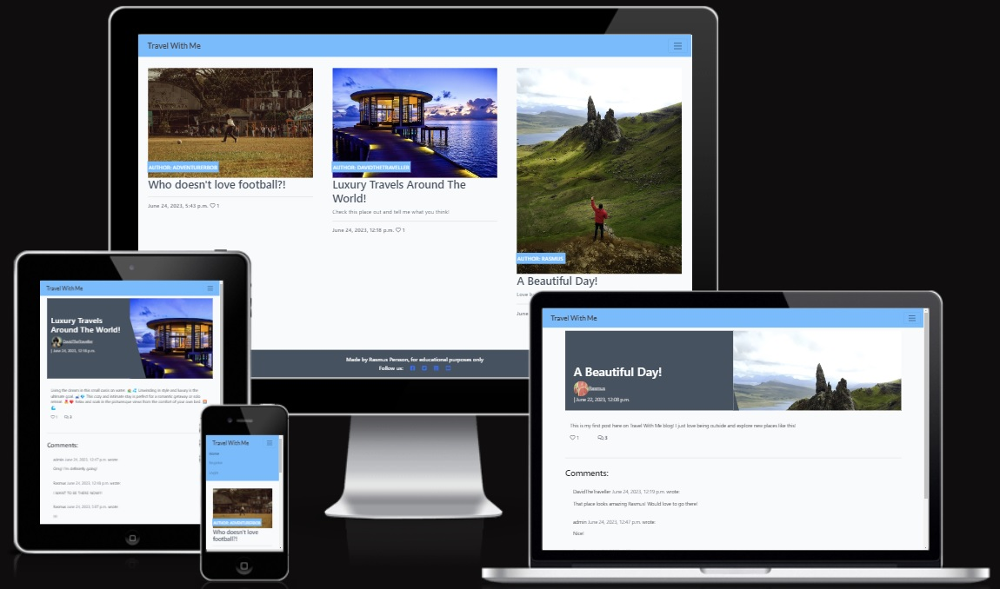

# Travel With Me Blog

## A Django and Python based blog website
> This blog is meant for travellers
> who wants to share their adventures in both text and images!
> Users can also comment, like eachothers posts, create and edit a profile page!

### - By Rasmus Persson

### [Live Site](https://rasmus-djangoblog.herokuapp.com/)

### [Repository](https://github.com/Mysanthropium/djangoBlog)

## Table of contents

1. [UX](#UX)
2. [Agile Development](#Agile-Development)
3. [Features](#Features)
4. [Features left to implement](#Features-left-to-implement)
5. [Technology Used](#Technology-Used)
6. [Testing](#Testing)
7. [Bugs](#Bugs)
8. [Deployment](#Deployment)
9. [Credits](#Credits)
10. [Contents and resources](#Contents-and-resources)

## UX
### Project Planning
* Database structure
    * Lucidchart helped me to plan out the data and the relationships between them:

    

* Further into the project I also used Google Sheets:
    * Userprofile Model:

    

    * Post Blog Model:

    

    * Comment Model:

    

### Design
I came up with this idea of just creating a simple blog where users can create their own profile page with a profile image, a bio, posting blogs of their travels, comment and interact with other users and talk about the places they went. The design is fairly simple, showing blog posts on the home page where you can create an account using the burger icon in the nav bar. If you already have an account you can simply log in and do these things.

## Agile Development
### Overview
I used User stories on GitHub to plan every step I needed to make sure I was working on the right things at the right time. Also to easily be able to add more features I came up with during production.

[Click here](https://github.com/users/Mysanthropium/projects/2/views/1) for my Kanban

I've learnt a lot by using this tool, I know there's much more to learn about what I'm able to do with it and will keep on using it for further projects.

### User stories:
1. [Account registration](https://github.com/users/Mysanthropium/projects/2/views/1?pane=issue&itemId=30649301)
2. [Create a profile page](https://github.com/users/Mysanthropium/projects/2/views/1?pane=issue&itemId=31508239)
3. [View a blog post](https://github.com/users/Mysanthropium/projects/2/views/1?pane=issue&itemId=30649030)
4. [View blogs list](https://github.com/users/Mysanthropium/projects/2/views/1?pane=issue&itemId=30648961)
5. [Comment on a post](https://github.com/users/Mysanthropium/projects/2/views/1?pane=issue&itemId=30649723)
6. [Like/unlike a post](https://github.com/users/Mysanthropium/projects/2/views/1?pane=issue&itemId=30649828)
7. [View comments on a post](https://github.com/users/Mysanthropium/projects/2/views/1?pane=issue&itemId=30649227)
8. [View likes](https://github.com/users/Mysanthropium/projects/2/views/1?pane=issue&itemId=30649153)
9. [Post as logged in member](https://github.com/users/Mysanthropium/projects/2/views/1?pane=issue&itemId=30778828)
10. [Site pagination](https://github.com/users/Mysanthropium/projects/2/views/1?pane=issue&itemId=30648672)
11. [Member authorization](https://github.com/users/Mysanthropium/projects/2/views/1?pane=issue&itemId=31185100)
12. [Update and Delete own posts as logged in member](https://github.com/users/Mysanthropium/projects/2/views/1?pane=issue&itemId=30776740)
13. [Edit profile page](https://github.com/users/Mysanthropium/projects/2/views/1?pane=issue&itemId=31472559)
14. [Change password](https://github.com/users/Mysanthropium/projects/2/views/1?pane=issue&itemId=31476269)
15. [Manage posts](https://github.com/users/Mysanthropium/projects/2/views/1?pane=issue&itemId=30649936)

#### Left to implement:
1. [Create events](https://github.com/users/Mysanthropium/projects/2/views/1?pane=issue&itemId=31185397)
2. [Plan meetups](https://github.com/users/Mysanthropium/projects/2/views/1?pane=issue&itemId=31679745)
3. [Search for other members](https://github.com/users/Mysanthropium/projects/2/views/1?pane=issue&itemId=30776745)
4. [Friend requests](https://github.com/users/Mysanthropium/projects/2/views/1?pane=issue&itemId=31679757)

[Back to top](#travel-with-me-blog)

## Features
#### Not logged in users:
* Can read posts
* Can create an account

#### Logged in users:

### Features left to implement
* Let the player choose a grid size and number of ships.
* Play against the computer.
* Add different ship sizes.
* Let the player place their own ships.

## Technology Used
### Python
* To create the application

### Heroku
* For deployment and hosting of the application

### GitHub
* Used to store code

### Gitpod
* The IDE of choice for the application

### Git
* Used for version control

### Modules used
* 'random' was used to randomize ship placements.
* 'sys and os' was used to clear terminal.

## Testing
* The code is tested using [PEP8](https://pep8ci.herokuapp.com/)
   * With the only warnings being in the ascii art boat image.

* Manual testing:
   * Test start game function so it only accepts letter 'a'.
   * Test enter ship row so it only accepts the correct values, else it lets you know and try again.
   

   * Test enter ship column so it only accepts the correct characters, else it lets you know and try again.
   
   
   * Test the play again function so it only accepts the letter 'y', else sends message 'Thank you for playing!'.

### Bugs and issues
* There's an issue in the ascii art, resulting in warnings in PEP8.

## Deployment
### Version Control
Using GitPod to push code to main repository in GitHub.
* In GitPod terminal use "git add ." to add the changes.
* Then use "git commit -m "push comment"" to make a comment to your push.
* Finally use "git push" to push the update to the repository on GitHub.

### App deployment
Using Heroku for app deployment.
* Create a new app on your dashboard.
* Navigate to "Settings" in your new app.
* Using the "Config Vars" add PORT to KEY, and 8000 to its VALUE.
* Install the buildpacks needed for this project. In this order!
   * Python
   * node.js
* Then navigate to deploy section and choose GitHub.
* Connect to your GitHub repository by searching for your repository name.
* Using "automatic" deployment, deploys your commits to Heroku.
* Now we can click the "App" button in the top right corner to run our application.

## Credits
### [YouTube](https://www.youtube.com/)
* For having great learning content.

### [Python](python.org)
* For beginner friendly tutorials.

### [GitHub](docs.github.com)
* For learning how to document a nice looking readme.

## Contents and resources
### [YouTube](https://www.youtube.com/)
* Can't show YouTube enough appreciation.

### [ASCII Art](https://www.asciiart.eu/)
* For creating my boat art.

### Knowledge Mavens
* Used [this](https://github.com/gbrough/battleship/blob/main/single_player.py) repository to build the functions in the game.

### Code Institute
* This project is a part of the course content.

## Acknowledgements
### Alan Bushell
* My cohort fascilitator being very helpful every week at our weekly standup meeting.

### Adeye Adegbenga
* My mentor at Code Institute, giving me good and helpful feedback.

[Back to Top of page](#battleships)

