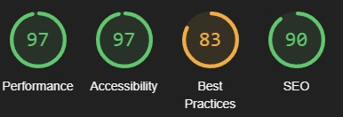
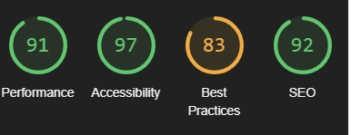

# Travel With Me Blog

## A Django and Python based blog website
> This blog is meant for travellers
> who wants to share their adventures in both text and images!
> Users can also comment, like eachothers posts, create and edit a profile page!

### - By Rasmus Persson

### [Live Site](https://rasmus-djangoblog.herokuapp.com/)

### [Repository](https://github.com/Mysanthropium/djangoBlog)

## Table of contents

1. [UX](#UX)
2. [Agile Development](#Agile-Development)
3. [Features](#Features)
4. [Features left to implement](#Features-left-to-implement)
5. [Technology Used](#Technology-Used)
6. [Testing](#Testing)
7. [Bugs](#Bugs)
8. [Deployment](#Deployment)
9. [Credits](#Credits)
10. [Contents and resources](#Contents-and-resources)

## UX
### Project Planning
* Database structure
    * Lucidchart helped me to plan out the data and the relationships between them:

    

* Further into the project I also used Google Sheets:
    * Userprofile Model:

    

    * Post Blog Model:

    

    * Comment Model:

    

### Design
I came up with this idea of just creating a simple blog where users can create their own profile page with a profile image, a bio, posting blogs of their travels, comment and interact with other users and talk about the places they went. The design is fairly simple, showing blog posts on the home page where you can create an account using the burger icon in the nav bar. If you already have an account you can simply log in and do these things.

## Agile Development
### Overview
I used User stories on GitHub to plan every step I needed to make sure I was working on the right things at the right time. Also to easily be able to add more features I came up with during production.

[Click here](https://github.com/users/Mysanthropium/projects/2/views/1) for my Kanban

I've learnt a lot by using this tool, I know there's much more to learn about what I'm able to do with it and will keep on using it for further projects.

### User stories:
1. [Account registration](https://github.com/users/Mysanthropium/projects/2/views/1?pane=issue&itemId=30649301)
2. [Create a profile page](https://github.com/users/Mysanthropium/projects/2/views/1?pane=issue&itemId=31508239)
3. [View a blog post](https://github.com/users/Mysanthropium/projects/2/views/1?pane=issue&itemId=30649030)
4. [View blogs list](https://github.com/users/Mysanthropium/projects/2/views/1?pane=issue&itemId=30648961)
5. [Comment on a post](https://github.com/users/Mysanthropium/projects/2/views/1?pane=issue&itemId=30649723)
6. [Like/unlike a post](https://github.com/users/Mysanthropium/projects/2/views/1?pane=issue&itemId=30649828)
7. [View comments on a post](https://github.com/users/Mysanthropium/projects/2/views/1?pane=issue&itemId=30649227)
8. [View likes](https://github.com/users/Mysanthropium/projects/2/views/1?pane=issue&itemId=30649153)
9. [Post as logged in member](https://github.com/users/Mysanthropium/projects/2/views/1?pane=issue&itemId=30778828)
10. [Site pagination](https://github.com/users/Mysanthropium/projects/2/views/1?pane=issue&itemId=30648672)
11. [Member authorization](https://github.com/users/Mysanthropium/projects/2/views/1?pane=issue&itemId=31185100)
12. [Update and Delete own posts as logged in member](https://github.com/users/Mysanthropium/projects/2/views/1?pane=issue&itemId=30776740)
13. [Edit profile page](https://github.com/users/Mysanthropium/projects/2/views/1?pane=issue&itemId=31472559)
14. [Change password](https://github.com/users/Mysanthropium/projects/2/views/1?pane=issue&itemId=31476269)
15. [Manage posts](https://github.com/users/Mysanthropium/projects/2/views/1?pane=issue&itemId=30649936)

#### Left to implement:
1. [Create events](https://github.com/users/Mysanthropium/projects/2/views/1?pane=issue&itemId=31185397)
2. [Plan meetups](https://github.com/users/Mysanthropium/projects/2/views/1?pane=issue&itemId=31679745)
3. [Search for other members](https://github.com/users/Mysanthropium/projects/2/views/1?pane=issue&itemId=30776745)
4. [Friend requests](https://github.com/users/Mysanthropium/projects/2/views/1?pane=issue&itemId=31679757)
5. [Add links to profile pages in comment section](https://github.com/users/Mysanthropium/projects/2/views/1?pane=issue&itemId=31708192)

[Back to top](#travel-with-me-blog)

## Features
#### Not logged in users:
* Can read posts
* Can create an account
* Can visit blog post authors profile page

#### Logged in users:
* Can read posts
* Can comment on posts
* Can like/unlike posts
* Can visit blog post authors profile page
* Can create posts
* Can update own posts
* Can delete own posts
* Can create profile page
* Can add profile picture
* Can add profile bio
* Can edit profile page, profile picture and bio
* Can manage account settings
* Can add first name, last name and email
* Can change password

#### Restrictions:
* Users can't access admin panel
* Users can't access other users edit profile page
* Users can't access other users account settings

### Features left to implement
* Edit/delete users own comments
* Search for other users profile
* Create events
* Plan meetups
* Friend requests
* Add links to profile pages in comment section
* More styling to the whole page

### Screenshots of Travel With Me blog
> Navigation bar

> Open navigation bar icon as logged in user

> Open dropdown profile as logged in user

> Open dropdown profile as new account

> Open navigation bar icon as NOT logged in user

> Blog posts

> Detailed blog post as logged in user

> Detailed blog post as NOT logged in user

> Footer

> Sign in page

> Sign out page

> Register page

> Profile page

> Create a profile page

> Create post page

> Edit profile page

> Edit settings page

> Change password page

> Mobile nav bar expanded

[Back to top](#travel-with-me-blog)

## Technology Used
### Python
* To create the logic of this application

### Django
* To make use of its built in admin panel and extra features like models to make coding easier
* Also used for Jinja templating

### Bootstrap 5
* To help out with styling the page

### Cloudinary
* To store images, static files

### Font Awesome
* For awesome icons and fonts

### Heroku
* For deployment and hosting of the application

### PostgreSQL
* Used for storing data for this project

### GitHub
* Used to store code and user stories for easier work

### Gitpod
* The IDE of choice for the application

### Git
* Used for version control

[Back to top](#travel-with-me-blog)

## Testing
* Manual testing:
   * I decided to manually test this application using my user stories and my own documentation through google sheets.

   > Navigation

   

   > Account Management

   

   > Security Tests

   

### W3 HTML
> base.html

> edit_profile_page.html

> edit_profile.html, 2 errors found on this page which isnt solved yet

> post_create.html

> post_delete.html

> post_detail.html

> post_update.html

> user_profile.html

### W3 CSS

### PEP8
> forms.py

> models.py

> urls.py

> views.py

[Back to top](#travel-with-me-blog)

## Lighthouse testing
### Desktop:

> base

> edit_settings

> manage_profile

> post_detail

> user_profile

### Mobile:

> base

> edit_settings

> manage_profile

> post_detail

> user_profile

[Back to top](#travel-with-me-blog)

### Bugs and issues
* Bugs found in edit_profile.html, not solved.
* Issue found where default profile image isnt working.
* Issue found where date and time in "last updated" on profile page isnt working properly.

## Deployment
### Version Control
Using GitPod to push code to main repository in GitHub.
* In GitPod terminal use "git add ." to add the changes.
* Then use "git commit -m "push comment"" to make a comment to your push.
* Finally use "git push" to push the update to the repository on GitHub.

### App deployment
Using Heroku for app deployment.
* Create a new app on your dashboard.
* Navigate to "Settings" in your new app.
* Using the "Config Vars" add PORT to KEY, and 8000 to its VALUE.
* Add PostreSQL as my database.
* Go back to "Config Vars" and add DATABASE_URL and copy the url you got from your PostgreSQL dashboard.
* Create a new file in your workspace called "env.py".
* Import the os library and set environment variable to DATABASE_URL to the address from Heroku.
* Add a secret key to the app using os.environ["SECRET_KEY"]="secret key here"
* Add this secret key and add it to config vars in the Heroku app settings.
* In settings.py in the django app import Path from pathlib, os and dj_database_url.
* Insert the line if os.path.isfile("env.py"): import env
* Navigate down and find the SECRET_KEY, replace the key with SECRET_KEY = os.environ.get('SECRET_KEY')
* Replace the database section with DATABASES = { 'default': dj_database_url.parse(os.environ.get("DATABASE_URL"))}
* Go to terminal in your workspace and migrate the models to the new database connection.

### Cloudinary
* Log in or create a Cloudinary account.
* Copy your CLOUDINARY_URL.
* Navigate to your env.py and add os.environ["CLOUDINARY_URL"] = "add cloudinary_url here".
* Navigate to Heroku settings again and add CLOUDINARY_URL in config vars.
* Go to settings.py and add cloudinary library to INSTALLED_APPS. cloudinary_storage, django.contrib.staticfiles and cloudinary IN THIS ORDER.
* Add static files settings to settings.py: url, storage path, directory path, root path, media url and default file storage.
* Link the file to the templates directory in Heroku TEMPLATES_DIR = os.path.join(BASE_DIR, 'templates').
* Change templates directory to TEMPLATES_DIR - 'DIRS': [TEMPLATES_DIR].
* Add your Heroku app url to ALLOWED_HOSTS.
* Create three new folders media, static and templates
* Create a Procfile
* In the Procfile, add web: guincorn project name here.wsgi
* Then push all changes to GitHub.
* Deploy to Heroku manually in Heroku deploy tab and watch it the first time, then you can add automatic uploads.

[Back to top](#travel-with-me-blog)

## Credits
### [YouTube](https://www.youtube.com/)
* For having great learning content.

### [Django](https://www.djangoproject.com/)
* For built in admin panel and additional useful features.

### [Python](python.org)
* For beginner friendly tutorials.

### [GitHub](docs.github.com)
* For learning how to document a nice looking readme.

### [Bootstrap](https://getbootstrap.com/)
* For helping me style the project.

### [Cloudinary](https://cloudinary.com/?&utm_campaign=1329&utm_content=instapagelogocta-selfservetest)
* For storing media files

## Contents and resources
### [YouTube](https://www.youtube.com/)
* Can't show YouTube enough appreciation.

### [John Elder](https://www.youtube.com/@Codemycom)
* For well made tutorials that's easy to understand.

### Code Institute
* This project is a part of the course content.

## Acknowledgements
### Alan Bushell
* My cohort fascilitator being very helpful every week at our weekly standup meeting.

### Adeye Adegbenga
* My mentor at Code Institute, giving me good and helpful feedback.

### Andreas Karlsson
* A fellow classmate who's always there to help. Definietly worth mentioning.

[Back to top](#travel-with-me-blog)

